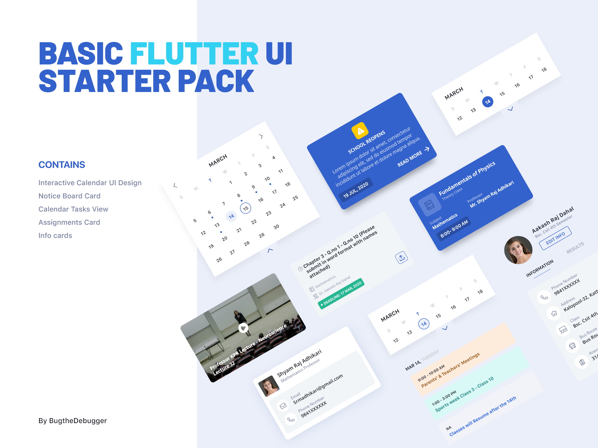

# Basic UI Toolkit [Theme: School]

## Descrption

A basic UI toolkit to get you started with flutter application development.

**Widget List:**

- **SchoolToolkitButton:** Button with a busy indicator
- **SchoolLocationWidget:** Card to display school information
- **OutlinedButton:** Button with only outline border with a busy indicator
- **SchoolToolkitTextField:** Custom text field
- **SchoolToolkitRoleButton:** Animated role selection button
- **OverlappingButtonCard:** Overlapping container with a hovering button on the bottom
- **Calendar:** Calendar with two view states: [expanded(shows the entire calendar), shrink(shows only a week)]
- **NepaliCalendar:** Nepali Calendar with two view states: [expanded(shows the entire calendar), shrink(shows only a week)]
- **EventCard:** Displays the time and event
- **RoutineCard:** Displays the Name of class, Subject, Time and Professor.
- **DeadlineCard:** Display a deadline
- **AssignmentCard:** Displays the assignment, deadline, subject with optional parameters to handle upload
- **HighlightedIcon:** Custom container that highlights the icon passed. Takes in an optional busy parameter to display loading indicator.
- **FeaturedVideoCard:**

## Example

The example file contains a catalog for all the available widgets.

## Support

Like what you see? Support me by buying me a coffee :)

<link href="https://fonts.googleapis.com/css?family=Cookie" rel="stylesheet"><a class="bmc-button" target="_blank" href="https://www.buymeacoffee.com/bugthedebugger">Buy me a coffee</a>

## License

`MIT License`
